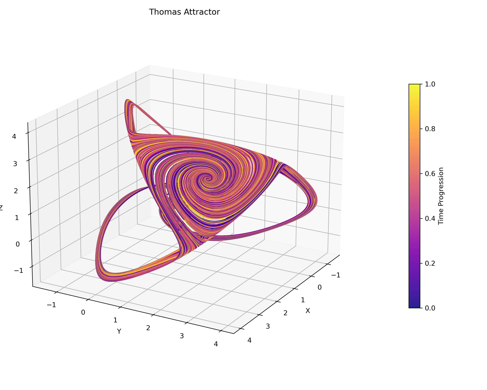
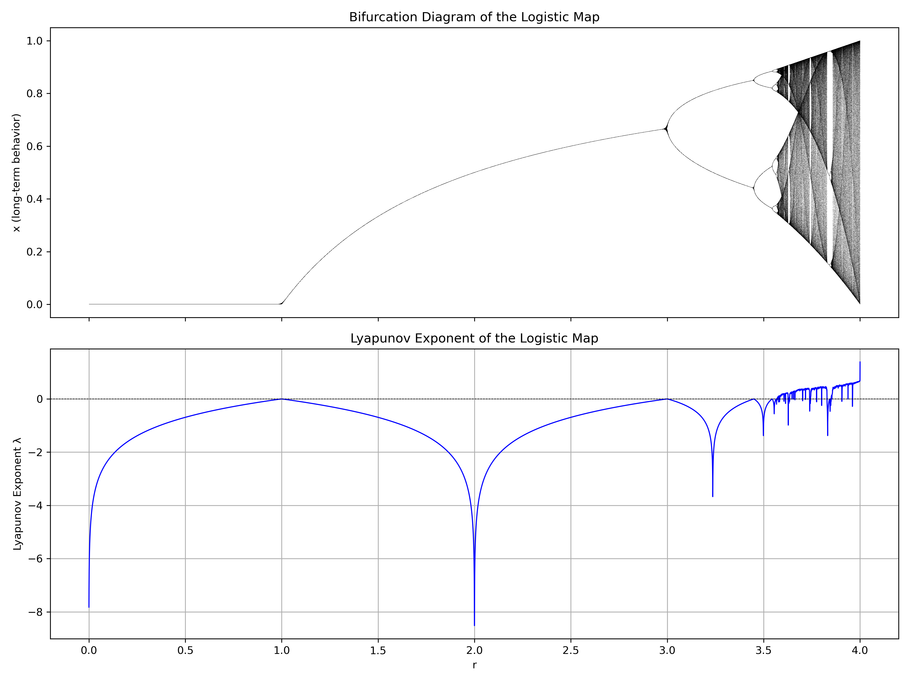

## Fractals, Self-Similar and Chaotic Systems 
This repository is an experimental collection of Python scripts for simulating and visualizing chaotic attractors, bifurcations, and fractal-like dynamical systems. The goal is to explore their behavior through numerical simulation, visual pattern recognition, and basic dynamical analysis methods (e.g., Lyapunov exponents, phase portraits, dimensionality metrics, Poincaré sections, etc.).

Each script focuses on a different attractor (e.g., Lorenz, Rossler, Aizawa, Chen-Lee) with options to animate or export 2D/3D plots.

This project will also serve as a dataset generator for future symbolic regression experiments, particularly for training PySINDy models to rediscover underlying equations from the generated time series.
